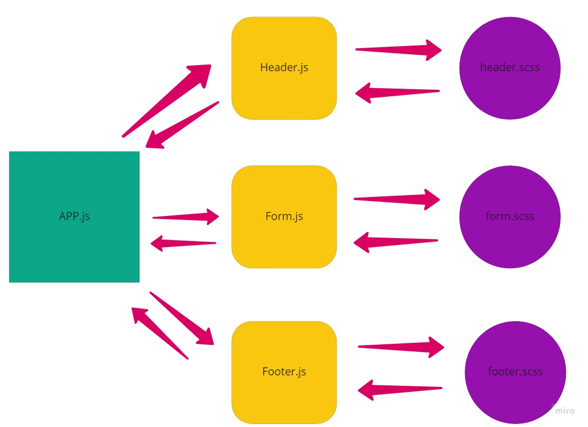

# RESTy

RESTy is an API testing tool that can be run in any browser, allowing a user to easily interact with APIs in a familiar interface.

## Author: Omar Ewies

* [Deployment](https://resty-oebitw.netlify.app/)

* [Pull Request](https://github.com/oebitw/RESTy/pulls?q=is%3Apr+is%3Aclosed)

## Run the app
* npm install
* npm start

## UML

